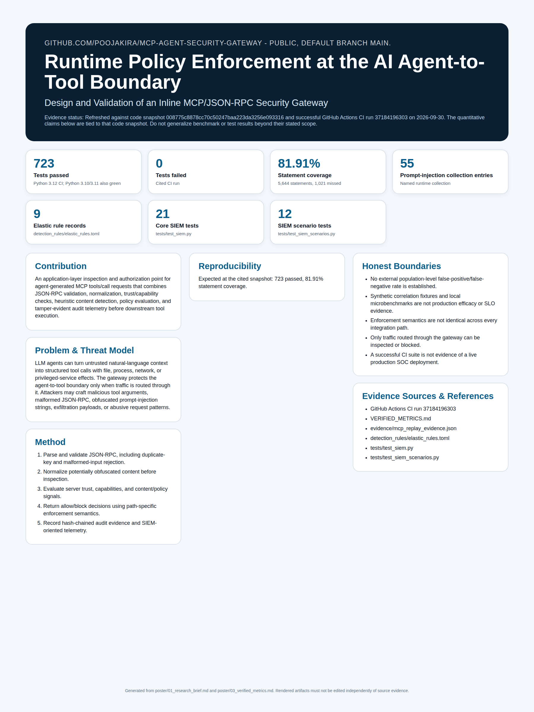

<!-- security-systems-poster -->
## Research Poster

**Security Systems / 01 — Runtime Policy Enforcement at the AI Agent-to-Tool Boundary**

[](poster/poster_36x48.pdf)

> Technical research poster (36 x 48 in). Click the image for the print-resolution **[PDF](poster/poster_36x48.pdf)**.
> Poster measurements are dated snapshots at their printed commits. Use the repository evidence files for newer results; do not read the poster as a verification of the latest `main`.
> Every metric on it is evidence-backed; historical/projected numbers are labeled and separated from current results.
<!-- security-systems-poster -->

# MCP Agent Security Gateway

> Inspect and enforce AI-agent MCP/JSON-RPC tool calls at the agent-to-tool boundary before they execute.

[](https://github.com/poojakira/mcp-agent-security-gateway/actions/workflows/ci.yml)
[](VERIFIED_METRICS.md)
[](VERIFIED_METRICS.md)
[](LICENSE)

Maintainer: Pooja Kiran ([@poojakira](https://github.com/poojakira)).

Portfolio: [Pooja Kiran Security Engineering Portfolio](https://poojakira.github.io/Pooja_Kiran_Portfolio_Website/).

## Overview

`mcp-agent-security-gateway` sits between an AI agent (MCP client) and downstream MCP servers and inspects each `tools/call` request over JSON-RPC before it executes, returning an allow/block decision. It applies prompt-injection, PII/exfiltration, capability/shadow-server, and process/egress-policy checks, and records tamper-evident audit and telemetry. It exists because an agent that can call tools, assume roles, and load artifacts is making privileged decisions on infrastructure, and nothing in the base MCP protocol inspects those calls. Enforcement applies only to traffic routed through a supported integration path. This is an engineering research prototype with tested enforcement paths, not a network firewall, customer deployment, or deployed SOC.

**Data-protection scope:** PII and exfiltration checks apply to supported, routed tool-call paths. They are signals and scoped policy controls, not complete data-loss prevention.

## Verified Snapshot

Verified against code snapshot `008775c8878cc70c50247baa223da3256e093316` on Python 3.12 (CI run `37184196303`). Evidence: [VERIFIED_METRICS.md](VERIFIED_METRICS.md).

| Metric | Verified snapshot value |
|---|---:|
| Tests | 723 passing (Python 3.12; same suite green on 3.10/3.11/3.12) |
| Statement coverage | 81.91% (5,644 statements; 1,021 missed) |
| Prompt-injection patterns | 55 (`INJECTION_PATTERNS`) |
| Elastic Security rules | 9 |
| Core SIEM tests | 21 |

## Security Problem

MCP gives agents a standardized way to invoke external tools that can read data, send messages, reach networks, or execute operations. That creates a trust boundary between model-generated requests and systems that can act. The gateway addresses whether a caller can apply explicit validation, authorization, detection, audit, and policy controls before selected tool calls reach a downstream server — covering prompt-injection content in arguments, unexpected server/capability use, sensitive-data leakage, process-execution intent, and disallowed egress destinations.

## Threat Model & Scope

Adversaries modeled: malicious prompt authors, compromised MCP servers, rogue agents, and insiders with log access. See [THREAT_MODEL.md](THREAT_MODEL.md) for the full model and residual risks.

**In scope:** JSON-RPC traffic routed through the gateway (stdio proxy or the HTTP control plane); heuristic detection; tamper-evident audit.

**Out of scope / not claimed:** It is not an OS firewall, endpoint agent, or complete DLP system. Its egress control is application-layer policy, not packet-level enforcement. Detectors are heuristic (false positives and negatives possible). Enforcement depends on the integration path; only routed traffic can be inspected or blocked.

## Architecture

```text
Agent / MCP client
       |
       v
Inline stdio proxy  OR  HTTP control plane (/v1/inspect_call)
       |
       +--> parse / normalize (JSON-RPC 2.0)
       +--> capability + shadow-server checks
       +--> content / policy signals (injection, PII, exfiltration, egress)
       +--> audit (hash-chained) + WAL + telemetry
       |
       v
allow / block decision  (fail-closed on detector/circuit-breaker error)
       |
       v
downstream MCP server or integrating application
```

Enforcement depends on the integration path: the Python wrapper raises `ToolBlocked` when the control plane returns `allowed=false`; the stdio proxy rejects malformed/duplicate-key JSON and blocks disallowed batched calls.

## Core Capabilities

- Inline MCP stdio proxy for selected `tools/call` requests
- JSON-RPC 2.0 parsing and request validation
- Prompt-injection-oriented argument inspection with normalization (55 patterns)
- Server-registry and capability (shadow-server) checks
- PII/sensitive-data and exfiltration signals
- Application-level process-execution and egress-policy decisions
- Hash-chained audit logging and write-ahead logging
- Rate limiting, tracing, metrics, circuit breaker (fail-closed), shadow mode
- ECS-formatted security events plus a local Elastic detection lab (9 rules)
- Docker and Kubernetes deployment templates
- Stable multi-credential authentication (`MCP_API_KEYS`) with legacy single-key compatibility
- Trusted source-address capture: socket peer by default; `X-Forwarded-For` accepted only from configured trusted proxy CIDRs
- Privacy-preserving credential/network telemetry with local HMAC-SHA256 fingerprints for exact IP, /24-or-/64 network, and /16-or-/48 block
- Vendor-neutral three-credential smoke sender that batches one queued event per distinct credential path and redacts runtime secrets from status output

## Recent verified additions

### Privacy-preserving credential/network telemetry

`src/mcp_monitor/production/identity_telemetry.py` adds a locally computed telemetry surface for external behavioral-validation workflows without exporting raw API credentials or raw source addresses. The gateway supports multiple stable credentials, canonicalizes IPv4/IPv6 source addresses (including IPv4-mapped IPv6), derives exact/network/block inputs, and fingerprints them with `HMAC-SHA256(key=tenant_salt, message=UTF-8(value)).hexdigest()[:32]`. Forwarded source headers are only trusted when the socket peer belongs to an explicitly configured trusted proxy CIDR; otherwise the socket peer is authoritative. Current event objects set `tokens_in = 0` and `tokens_out = 0` where token accounting is unavailable. Live transport records use an integer schema version of `1`, client identifier `mcp-gateway/1.0.0`, `backfill: false`, an `events` array, and a positional `event_fps` array. Each event fingerprint is computed locally as HMAC-SHA256 over `"evt:" + event_id`, truncated to 32 lowercase hexadecimal characters. The internal event ID is not transmitted. Queued envelopes are immutable and retries resend the same stored envelope/fingerprint.

The latest cited quantified implementation snapshot reports **723 tests passed** with **81.91% statement coverage** on Python 3.12, with the same test suite green on Python 3.10 and 3.11.

These follow the same discipline as the rest of the repo: separate detection from enforcement, attach scope to every metric, and label anything synthetic or unverified. Subsection-specific measurements are scoped to those modules; the repository-wide test/coverage snapshot above applies to the Python suite at the cited commit.

### Policy-as-code PDP (enforcement)

`src/mcp_monitor/policy/policy_engine.py` is a fail-closed, default-deny Python Policy Decision Point: deny-wins evaluation, structured reason codes, and anti-SSRF egress checks. Enforcement is proven, not asserted — `tests/test_policy_enforcement.py` is **15 passed** (verified locally with `.venv`, Ruff clean), including tests that a denied tool call **never reaches the downstream transport** (`send`/`receive` not called) and that allowed calls do. Rego policies under `policy/rego/` exist for OPA parity but are **UNVERIFIED here — requires the `opa` binary**. See [docs/policy/POLICY_AS_CODE.md](docs/policy/POLICY_AS_CODE.md).

### Detection-engineering lifecycle

`src/mcp_monitor/siem/lifecycle.py` generates a coverage matrix (6 correlation rules + 9 Elastic rules mapped to 7 ATT&CK techniques, with ATLAS cross-references) plus per-rule precision/recall. The precision/recall numbers are computed on **synthetic fixtures only**: micro-averaged P/R/F1 = **1.000** over **9 fixture sequences** — this measures fixture coverage, **not real-world efficacy**. A local latency microbench over **2000 synthetic events** records **p50 0.47ms, p95 1.19ms, p99 1.75ms (~1863 events/s single-process)** — a **local microbench, not a production SLA**. Artifacts in [docs/detection/](docs/detection/); tuning log in [docs/detection/TUNING_LOG.md](docs/detection/TUNING_LOG.md); tests in `tests/test_detection_lifecycle.py`.

### Native inspection cores (Rust + C++)

The `rust/` crate ports the fail-closed JSON-RPC inspection decision (parse, duplicate-key rejection, batch atomicity, allow/block/indeterminate) to Rust. Verified via a `rust:1-slim` Docker build: `cargo build` **0 warnings**, `cargo test` **9 passed / 0 failed**. See [rust/README.md](rust/README.md).

The `cpp/` directory ports the same fail-closed inspection core to C++17, with a small self-contained JSON parser that explicitly rejects duplicate keys. Verified via a `gcc:13` Docker build: compiled with `-Wall -Wextra -Wpedantic` (no warnings), `make test` **11/11 checks passed**, and the CMake path reports `ctest` **100% passed (1/1)**. Both native cores hold the same parity table as the Python implementation. See [cpp/README.md](cpp/README.md).

## Installation

```bash
git clone https://github.com/poojakira/mcp-agent-security-gateway.git
cd mcp-agent-security-gateway
python -m venv .venv
source .venv/bin/activate   # Windows: .\.venv\Scripts\Activate.ps1
python -m pip install --upgrade pip
python -m pip install -e ".[dev,server]"
python -m pytest tests -q
```

## Usage

Run a downstream stdio MCP server through the proxy:

```bash
python -m mcp_monitor.proxy.stdio_proxy -- <server-command> [args...]
```

Run the local FastAPI control plane (default `127.0.0.1:8000`):

```bash
python run_realtime.py
```

Production API (port 8080) requires `X-API-Key` on inspection/metrics endpoints; one legacy key (`MCP_API_KEY`) or multiple stable credentials (`MCP_API_KEYS`) may be configured. `/v1/health` and `/v1/ready` are open for orchestration. See [RUNBOOK.md](RUNBOOK.md).

## Testing

```bash
python -m pytest tests -q --cov=mcp_monitor
ruff check src tests
ruff format --check src tests
bandit -r src -ll
pip-audit
```

Latest cited quantified verification snapshot (`008775c8878cc70c50247baa223da3256e093316`, CI run `37184196303`): **723 passing, 81.91% statement coverage** on Python 3.12; the same suite is green on Python 3.10 and 3.11. GitHub Actions is the authoritative environment for published test/coverage claims.

## CI/CD

GitHub Actions runs Ruff, Pyright, Bandit, pip-audit, CodeQL, Trivy, SBOM generation, Docker build validation, and the Python 3.10/3.11/3.12 test matrix plus a Windows control-plane job. Later documentation-only verification heads containing the same runtime code as the cited test snapshot completed the full CI and Production Gate successfully.

## Security & Documentation

- [SECURITY.md](SECURITY.md) · [THREAT_MODEL.md](THREAT_MODEL.md) · [SECURITY_AUDIT.md](SECURITY_AUDIT.md)
- [RUNBOOK.md](RUNBOOK.md) · [INCIDENT_RUNBOOK.md](INCIDENT_RUNBOOK.md) · [PRODUCTION.md](PRODUCTION.md)
- [VERIFIED_METRICS.md](VERIFIED_METRICS.md) · [RESEARCH_REPORT.md](RESEARCH_REPORT.md)
- Detection lab: [detection_lab/README.md](detection_lab/README.md)
- Performance baselines: [docs/PERFORMANCE_BASELINE.md](docs/PERFORMANCE_BASELINE.md)

## Limitations

Heuristic detectors can be evaded; the fixed red-team catalog is a regression suite, not a population-level detection rate. No production latency/throughput/uptime guarantee is made. Enforcement is only as strong as the integration path routing traffic through the gateway.

## Project Status

**Engineering research prototype.** Functional, tested, and CI-validated, with fail-closed auth and tamper-evident audit. It has not been proven at production scale or in a live SOC deployment.

## License

MIT — see [LICENSE](LICENSE).

<!-- repo-verification:start -->
## Verification update — 2026-09-30

- **Scope:** Account-wide `poojakira` repository pass covering source/configuration, CI/release workflows, security-hygiene gates, dependency/SAST controls, and documentation consistency.
- **Remediation:** Repaired the Ruff formatting failure, reran the repository gates, and kept security checks blocking.
- **Verification state:** CI, Production Gate, Security Hygiene, Documentation Integrity, and the formatting repair workflow completed successfully after the fix.
- **Security note:** Intentional attack payloads and red-team fixtures were preserved; they were not treated as live secrets or executable production behavior.
- **Evidence boundary:** This update records repository and GitHub Actions evidence observed during the pass. It is not a claim of independent penetration testing, production deployment, or zero residual risk.
<!-- repo-verification:end -->

## Verification checkpoint — 2026-09-30

- **Checked snapshot:** `2801e7b80735e5d7392ad82b9ad867c060f2e013`
- **Status:** VERIFIED GREEN
- **Evidence:** CI, Production Gate, Security Hygiene, and Documentation Integrity completed successfully for the cited checked snapshot.
- This record is immutable and date-bounded. Later `main` commits may be newer; consult GitHub Actions for the latest run state. It does not claim zero vulnerabilities or universal production readiness.


## Secret handling

Keep runtime credentials outside Git. If this repository provides an `.env.example` or `.env.sample`, copy it to a local `.env` or `.env.local` and fill in values locally; the real environment file must remain untracked.

Do not commit AWS access keys or session credentials, API tokens, service-account JSON, private keys, package-manager credentials, Terraform state, or secret-bearing `tfvars`. CI/deployment credentials belong in GitHub Actions secrets or the deployment provider's secret manager. AWS account IDs are identifiers; AWS access-key IDs, secret access keys, and session tokens are credentials.

If a real credential is ever exposed, revoke or rotate it at the provider first, then remove it from the working tree and reachable Git history. The Security Hygiene workflow checks the current tree and reachable history for common credential formats without printing matched secret values.

<!-- security-local-config:start -->
## Secrets and local configuration

- Never commit real API keys, access tokens, passwords, cloud credentials, private keys, or a populated `.env` file.
- Local `.env` and `.env.*` files are ignored by Git. Only safe templates such as `.env.example` or `.env.sample` may be committed, and they must contain placeholder or empty values only.
- If an integration needs credentials, create your own local `.env` file (or use your shell/secret manager) and supply **your own** API key. In GitHub Actions, use repository/environment secrets rather than hard-coding values in workflow YAML.
- Do not copy or reuse any credential that appears in repository history, examples, tests, screenshots, logs, or documentation. Test strings are not intended to be usable credentials.
- If a real credential is ever committed, **revoke or rotate it at the credential provider first**, then remove it from the current tree and reachable Git history. Deleting a key from GitHub does not revoke it.
<!-- security-local-config:end -->


## Recruiter demo

See [60-second recruiter demo](docs/RECRUITER_DEMO_60S.md).

## Recruiting evidence audit (2026-10-09)

See [the bounded recruiting evidence audit](docs/RECRUITER_EVIDENCE_AUDIT_2026-10-09.md) for current dated verification, test-scope limitations and unsupported impact claims.


## Verification status — October 9, 2026

See [evidence and limitations](docs/VERIFICATION_STATUS_2026-10-09.md). Passing CI at a dated commit or a preview deployment does not certify all source, security controls or operational claims.
